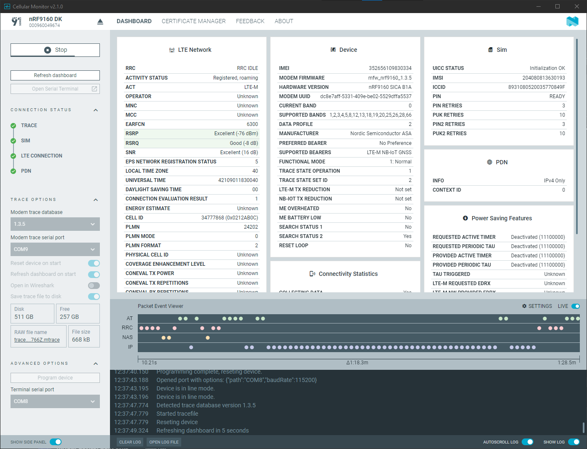

# Capturing a modem trace

The {{app_name}} generates a broad set of cellular environment data displayed in the [**Dashboard**](./overview.md#dashboard-tab) tab panels. Optionally, you can also view the modem trace in Wireshark and observe application logging and the modem dialog in [Serial Terminal](https://docs.nordicsemi.com/bundle/nrf-connect-serial-terminal/page/index.html).

See [Minimum requirements and limitations](./requirements.md) and [Preparing the device for modem trace](./preparing.md).

Complete the following steps to trace data:

1. Set the trace options in the {{app_name}} side panel according to your needs. See [Overview and user interface](./overview.md) for the description of the available options.

2. Click **Start** to trace. 
   Depending on the options you have chosen, the application starts tracing and applies the selected options. The initialization of tracing can take some time.

3. Generate additional trace data.

    - Click **Refresh dashboard** to send a set of AT commands to the device to feed the trace with information on the environment.
    - [Send AT commands using the Serial Terminal](https://docs.nordicsemi.com/bundle/nrf-connect-serial-terminal/page/viewing_and_sending_at_commands.html) and from the dashboard fields.

4. Follow the progress in the [**Connection Status**](./overview.md#connection-status) side panel. 
   On success, the stage's status indicator turns green with a checkmark.

    If a stage fails, a red X is displayed along with a reason for the failure. You can check the corresponding dashboard field for troubleshooting information.

     - If the minimum requirements for trace have been met, the **Trace** checkmark should be green. See [Minimum requirements and limitations](./requirements.md) and [Preparing the device for modem trace](./preparing.md).
     - **SIM** shows the Subscriber Identity Module (SIM) card status. For example, if you remove your SIM card from the device, the SIM turns red.
     - **Long-Term Evolution (LTE) Connection** depends on conditions in the local cellular network to which you are subscribed.
     - **Packet Data Network (PDN)** turns green when the device has successfully connected to the connection endpoint.

For more information on trace data visualization, see [Viewing a modem trace in the {{app_name}}](./viewing.md).
