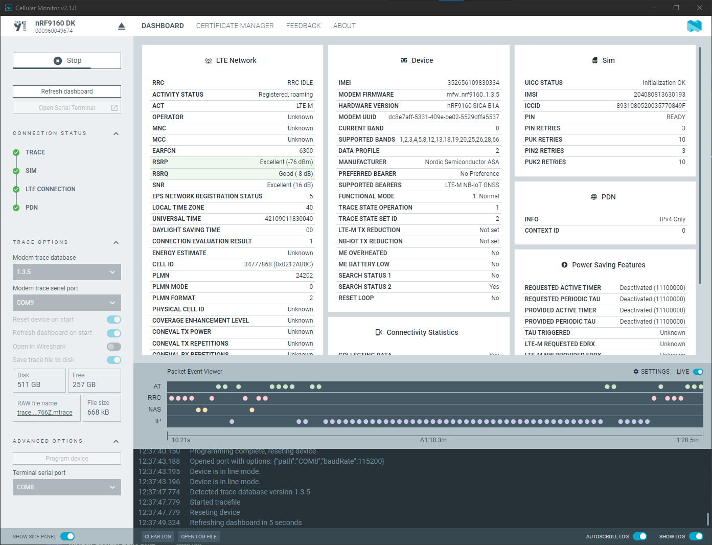

# Capturing a modem trace

The Cellular Monitor app generates a broad set of cellular environment data displayed in the [**Dashboard**](./overview.md#dashboard-tab) tab panels. Optionally, you can also [view the modem trace in Wireshark](overview.md#open-trace-file-in-wireshark) and observe application logging and the modem dialog in [Serial Terminal](https://docs.nordicsemi.com/bundle/nrf-connect-serial-terminal/page/index.html).

## Preparing the device for modem trace

Complete the following steps to prepare the device for modem trace capture:

You must program your device with the required firmware to prepare it for modem trace capture. Your application or sample must enable modem trace and AT commands.

Depending on the device you are using:

- If you are using the nRF9160 DK or Nordic Thingy:91™, you can program the device with the precompiled firmware provided with the Cellular Monitor app. See the following pages for more information:

    - [Programming the nRF9160 DK firmware](programming_91dk.md)
    - [Programming Nordic Thingy:91 firmware](programming_thingy91.md)

- If you are using a [supported device](./index.md#minimum-requirements-and-limitations) other than the nRF9160 DK or Nordic Thingy:91, make sure to program it with the required firmware, as listed in [software requirements](index.md#software-requirements).

## Capturing modem trace data

Complete the following steps to trace data:

1. Set the trace options in the Cellular Monitor app side panel according to your needs. See [Overview and user interface](./overview.md) for the description of the available options.

1. If you want traces to be saved, make sure that [**Save trace file to disk**](overview.md#save-trace-file-to-disk) is enabled before starting the trace.

1. Click **Start** to trace. 
   Depending on the options you have chosen, the application starts tracing and applies the selected options. The initialization of tracing can take some time.

1. Generate additional trace data.

    - Click **Refresh dashboard** to send a set of AT commands to the device to feed the trace with information on the environment.
    - [Send AT commands using the Serial Terminal](https://docs.nordicsemi.com/bundle/nrf-connect-serial-terminal/page/viewing_and_sending_at_commands.html) and from the dashboard fields.

1. Follow the progress in the [**Connection Status**](./overview.md#connection-status) side panel. 
   On success, the stage's status indicator turns green with a checkmark.

    If a stage fails, a red X is displayed along with a reason for the failure. You can check the corresponding dashboard field for troubleshooting information.

     - If the minimum requirements for trace have been met, the **Trace** checkmark should be green. See [Minimum requirements and limitations](./index.md#minimum-requirements-and-limitations).
     - **SIM** shows the Subscriber Identity Module (SIM) card status. For example, if you remove your SIM card from the device, the SIM turns red.
     - **Long-Term Evolution (LTE) Connection** depends on conditions in the local cellular network to which you are subscribed.
     - **Packet Data Network (PDN)** turns green when the device has successfully connected to the connection endpoint.

For more information on trace data visualization, see [Viewing a modem trace in the Cellular Monitor app](./viewing.md).

If the trace data is not displayed or the file size does not increase, check the following settings:

- The trace serial port used. 
   The number and function of the serial ports depends on the selected device and the onboard application firmware.

    The virtual serial ports on a Nordic Semiconductor Development Kit (DK) are indexed from zero. Your computer's operating system maps each of the device's virtual serial ports to a unique, persistent serial port identifier for the device and computer. The nRF Connect for Desktop app lists the selected device's serial ports in ascending order of its virtual serial port index.

    !!! note "Note"
         Serial ports are also referred to as `COM` ports on Windows, `ttyACM` devices on Linux, and `/dev/tty` devices on macOS.

- The default UART trace settings: 1,000,000 baud rate, with hardware flow control enabled.