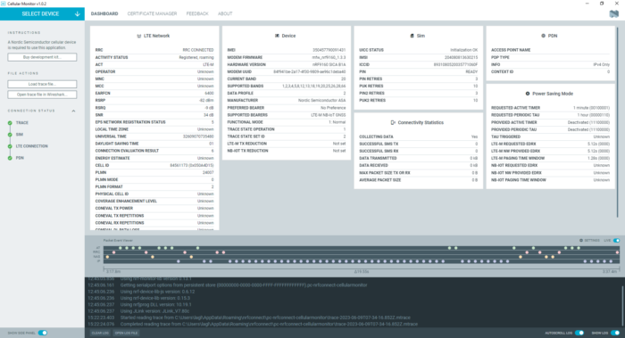

# Loading modem traces for playback

You can view previously collected traces in the {{app_name}}, including those captured in the legacy Trace Collector app.

1. Open the {{app_name}}.
1. Click **Load trace file...** in the side panel. 
   The file explorer opens.
1. Browse to the folder where you saved the trace. Select and double-click the file to open it. 
   The {{app_name}} auto detects the modem firmware version from the trace file.
   You can also select the modem trace database version from the dropdown list.

    

See [Viewing a Modem trace in the {{app_name}}](./viewing.md) for more information.