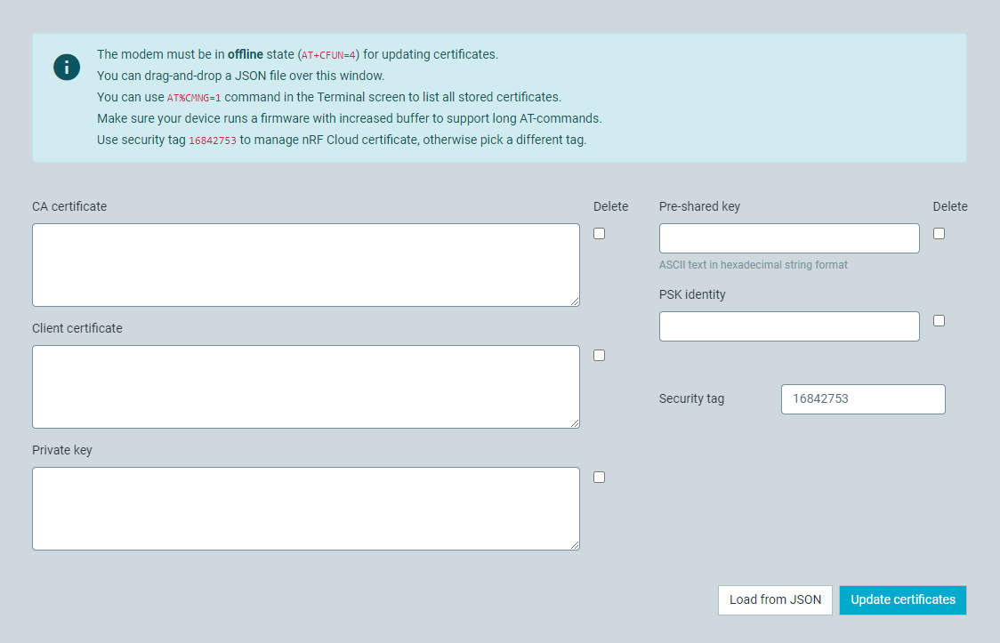

# Managing modem credentials

You can store and update modem credentials, such as keys or certificates, manually by sending [Credential storage management %CMNG](https://docs.nordicsemi.com/bundle/ref_at_commands/page/REF/at_commands/security/cmng.html) commands to the modem. The **Certificate Manager** tab simplifies this process by offering a graphical user interface for updating credentials.

Before you can update the credentials stored by the modem, you must put the modem into the offline state by sending the `AT+CFUN=4` AT command.

Each set of keys and certificates that is stored in the modem is identified by a security tag. This means that all related credentials share the same security tag. Send the `AT%CMNG=1` command in the terminal view to display a list of all certificates that are stored on your device. If you have [added your device in nRF Cloud](https://docs.nordicsemi.com/bundle/nrf-cloud/page/GettingStarted.html), you should have [generated the following credentials](https://docs.nordicsemi.com/bundle/nrf-cloud/page/Devices/Security/Credentials.html):

- Certificate Authority (CA) certificate
- Client certificate
- Private key with security tag `16842753`, which is the security tag for nRF Connect for Cloud credentials.

These credentials can be managed in **Certificate Manager** in the dedicated fields.

## Adding or updating credentials

Enter a security tag and the new keys or certificates. Then click **Update certificates**.

Instead of entering the credentials manually, you can also import a JSON file. To do so, click **Load from JSON**.

## Deleting keys or certificates

To delete a key or certificate, select the checkbox next to it. Then click **Update certificates**.

!!! note "Note"
     Deleting the text from the text field does not cause the key or certificate to be unset.
