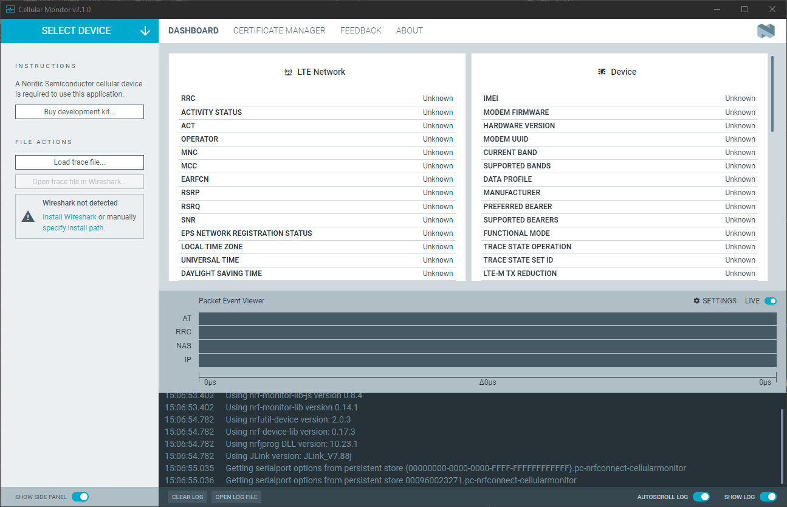

# Overview and user interface

After starting Cellular Monitor, the main application window is displayed.

The available options and information change after you **Select Device**. If a supported device is selected, you can capture traces; otherwise, traces can be played back from a file.

## Before selection

Before a device is selected, the side panel contains the following buttons:

### Select Device

Dropdown to list the devices attached to the computer. When you select a supported device, the app attempts to connect to two different serial ports. One of the ports is for communication and logging, the other is for modem trace.

### Buy development kit...

Opens a dialog with localized links to partner websites to purchase the supported devices.

### Load trace file...

Opens File Explorer and allows you to select a trace file. Traces captured using Cellular Monitor have the file extension `.mtrace`. You can also open files from `nrfutil trace` and `.bin` files from the legacy [nRF Connect Trace Collector](https://docs.nordicsemi.com/bundle/nrf-connect-tracecollector/page/index.html).

### Open trace file in Wireshark...

Opens file explorer and allows you to select an `.mtrace` or `.bin` file. The selected file is converted to Packet Capture Next Generation (PcapNG) format and displayed in Wireshark.

## After selection

When a device is selected, Cellular Monitor tries to discover its capabilities. The side panel options are updated depending on the results.

### Start

Starts tracing for the selected device.

!!! tip "Tip"
      You must have [Save trace file to disk](#save-trace-file-to-disk) or [Open in Wireshark](#open-in-wireshark) (or both) toggled on to be able to start tracing.

### Refresh dashboard

Extensively populates the dashboard fields by sending a set of recommended AT commands to your device. This button is available only if Cellular Monitor has identified either Modem Shell or [AT Host](https://docs.nordicsemi.com/bundle/ncs-latest/page/nrf/index.html) on the device, and if you started tracing.

You can toggle on [Refresh dashboard on start](#refresh-dashboard-on-start) so that this action is automatically run when the tracing starts.

When you start tracing, this button changes to **Sending commands** during the tracing initialization.

### Open Serial Terminal

Opens the Serial Terminal application in a new window. You can view the modem dialog and logging information from your application and the RTOS here. Depending on the application running, you can also send custom AT commands. See [nRF Connect Serial Terminal](https://docs.nordicsemi.com/bundle/nrf-connect-serial-terminal/page/index.html) for more information on the application.

### Connection Status

Displays the trace status. If you have enabled Modem Shell or [AT Host](https://docs.nordicsemi.com/bundle/ncs-latest/page/nrf/index.html) and click **Refresh dashboard**, the Connection Status is updated automatically. See [Capturing a Modem trace](./capturing.md) for more information.

### Trace Options

This section lists common tracing options.

#### Modem trace database

The trace database is used to decode the raw modem trace. Each modem firmware version has a separate trace database. The trace database version must match the modem firmware version of the selected device.

If [AT Host](https://docs.nordicsemi.com/bundle/ncs-latest/page/nrf/index.html) is enabled, choose **Autoselect** to have Cellular Monitor automatically select the trace database version. If not, select the database whose version matches your modem firmware from the dropdown list of databases.

#### Modem trace serial port

The serial port used to send the modem trace. It is the last port in the dropdown list if your application firmware uses default settings.

#### Reset device on start

If toggled on, this option will cause the device to reset before starting a new trace.

#### Refresh dashboard on start

If toggled on, this option will refresh the dashboard status automatically when you [start tracing](#start).

#### Open in Wireshark

If toggled on, this option will automatically detect your Wireshark installation. If you have Wireshark installed, it will open and display trace data live in Wireshark when the trace is started.
See [Using Wireshark](./wireshark.md) for more information.

#### Save trace file to disk

If toggled on, starting tracing will create a raw temporary trace file for storing a copy of the trace for future use. After you start tracing, the information about the file and its size appears under the toggle.

Clicking the file name opens its location.

### Advanced options

This section lists advanced tracing options.

#### Program device

Select and program precompiled sample applications and modem firmware to your device. The samples enable the trace and [AT Host](https://docs.nordicsemi.com/bundle/ncs-latest/page/nrf/index.html) prerequisites for Cellular Monitor. Modem firmware supporting trace is available with all samples, and you can choose to program the modem firmware or the application firmware, or both. The modem firmware needs only to be programmed once.

!!! note "Note"
     Programming the modem firmware deletes the application firmware. If you choose to program only the modem firmware, you need to reprogram the application firmware.

#### Terminal serial port

The serial port used to send AT commands to your device if Modem Shell or [AT Host](https://docs.nordicsemi.com/bundle/ncs-latest/page/nrf/index.html) is enabled. This is the port used by Serial Terminal. It is the first port in the drop-down list if your application firmware uses default settings.

## Dashboard tab

The dashboard contains detailed information about the connection and its components. During trace, dashboard fields are highlighted as they are populated.
See [Viewing a Modem trace in Cellular Monitor](./viewing.md) for more information.

### Packet Event Viewer

The **Packet Event Viewer** visualizes communication at the AT command, Radio Resource Control (RRC), Non-access Stratum (NAS), and Internet Protocol (IP) levels.
See [Viewing a Modem trace in Cellular Monitor](./viewing.md) for more information.

## Certificate Manager tab

See [Managing modem credentials](./managing_credentials.md).

## Feedback tab

The Feedback tab lets you send feedback about nRF Connect Cellular Monitor application to the application development team.

## Log

The Log panel allows you to view the most important log events, tagged with a timestamp. Each time you open the app, a new session log file is created. You can find the Log panel and its controls, below the main application Window.

- When troubleshooting, to view more detailed information than shown in the Log panel, use **Open log file** to open the current log file in a text editor.
- To clear the information currently displayed in the Log panel, use **Clear Log**. The contents of the log file are not affected.
- To hide or display the Log panel in the user interface, use **Show Log**.
- To freeze Log panel scrolling, use **Autoscroll Log**.

## About tab

You can view application information, restore defaults, access source code, and documentation. You also can find information on the selected device, access support tools, and enable verbose logging.