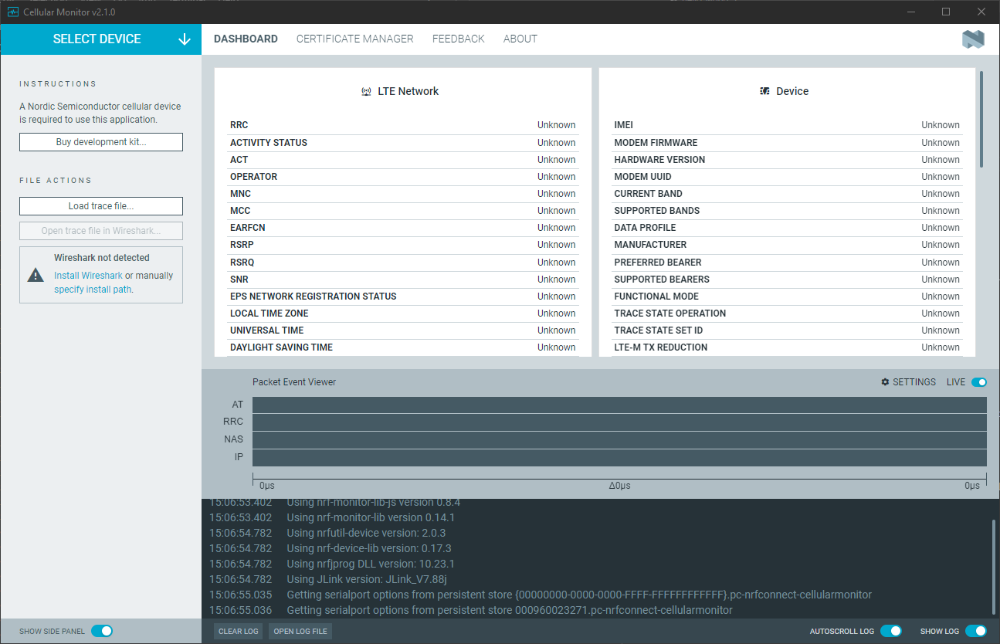
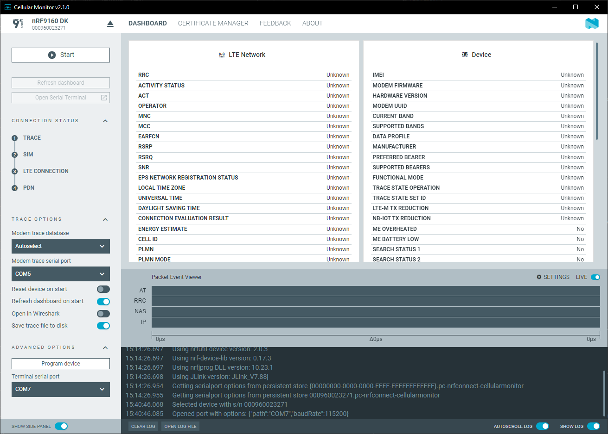
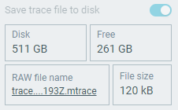
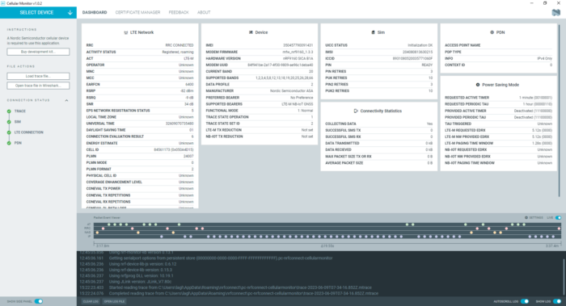
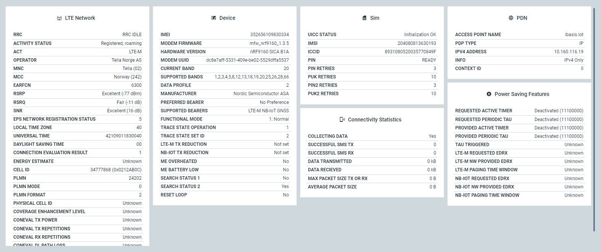
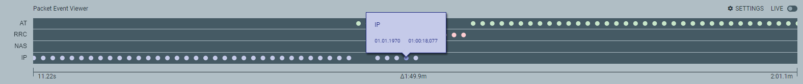

# Overview and user interface

After starting the Cellular Monitor app, the main application window is displayed.

## Common interface

This app uses the nRF Connect for Desktop UI framework. Shared UI elements such as **Select device**, **About** tab, and **Log** panel are described in the [Common user interface](https://docs.nordicsemi.com/bundle/swtools_docs/page/common_interface.html) documentation.

The available options and information change after you select a device. If a supported device is selected, you can capture traces; otherwise, traces can be played back from a file. When you select a supported device, the app attempts to connect to two different serial ports—one for communication and logging, the other for modem trace.

## Before selection

Before a device is selected, the side panel contains the following buttons:

### Buy development kit...

Opens a dialog with localized links to partner websites to purchase the supported devices.

### Load trace file...

Opens the file explorer and allows you to select a trace file. Traces captured using the Cellular Monitor app have the file extension `.mtrace`.

!!! note "Note"
     The `.mtrace` are binary files specific to the Cellular Monitor app. They have a different extension to separate them from `.bin` files. If you want to open these files in a tool that requires a `.bin` extension, replace the `.mtrace` extension with `.bin`. You can still open them in the Cellular Monitor app after the replacement.

You can also open files from [`nrfutil trace`](https://docs.nordicsemi.com/bundle/nrfutil/page/nrfutil-trace/guides/tracing.html) and `.bin` files from the legacy Trace Collector app.

See [Loading modem traces for playback](viewing.md#loading-modem-traces-for-playback) for more information.

### Open trace file in Wireshark...

Opens File Explorer and allows you to select an `.mtrace` or a `.bin` file. The selected file is converted to Packet Capture Next Generation (PcapNG) format and displayed in Wireshark.

Wireshark analyzes layers and protocols in the trace, in addition to AT commands. It can color and filter traffic based on packet type. See [DevAcademy article on viewing modem traces in Wireshark](https://academy.nordicsemi.com/topic/lesson-7-exercise-2/) for more information.

## After selection

When a device is selected, the Cellular Monitor app tries to discover its capabilities. The side panel options are updated depending on the results.

### Start

Starts tracing for the selected device.

!!! tip "Tip"
      You must have [Save trace file to disk](#save-trace-file-to-disk) or [Open in Wireshark](#open-in-wireshark) (or both) toggled on to be able to start tracing.

### Refresh dashboard

Extensively populates the dashboard fields by sending a set of recommended AT commands to your device.

This button is available only when the following conditions are met:

* Your device is programmed with either Modem Shell or [AT Host](https://docs.nordicsemi.com/bundle/ncs-latest/page/nrf/index.html)
* Tracing has been started.

You can toggle on [Refresh dashboard on start](#refresh-dashboard-on-start) so that this action is automatically run when the tracing starts.

When you start tracing, this button changes to **Sending commands** during the tracing initialization.

### Open Serial Terminal

Opens the Serial Terminal application in a new window. You can view the modem dialog and logging information from your application and the RTOS here. Depending on the application running, you can also [send AT commands](https://docs.nordicsemi.com/bundle/nrf-connect-serial-terminal/page/viewing_and_sending_at_commands.html). See the [Serial Terminal app](https://docs.nordicsemi.com/bundle/nrf-connect-serial-terminal/page/index.html) for more information on the application.

### Connection Status

Displays the trace status. If you have enabled Modem Shell or [AT Host](https://docs.nordicsemi.com/bundle/ncs-latest/page/nrf/index.html) and click **Refresh dashboard**, the Connection Status is updated automatically. See [Capturing a Modem trace](./capturing.md) for more information.

### Trace Options

This section lists common tracing options.

#### Modem trace database

The trace database is used to decode the raw modem trace. Each modem firmware version has a separate trace database. The trace database version must match the modem firmware version of the selected device.

If [AT Host](https://docs.nordicsemi.com/bundle/ncs-latest/page/nrf/index.html) is enabled, choose **Autoselect** to have the Cellular Monitor app automatically select the trace database version. If not, select the database whose version matches your modem firmware from the dropdown list of databases.

#### Modem trace serial port

The serial port used to send the modem trace. It is the last port in the dropdown list if your application firmware uses default settings.

#### Reset device on start

If toggled on, this option will cause the device to reset before starting a new trace.

#### Refresh dashboard on start

If toggled on, this option will refresh the dashboard status automatically when you [start tracing](#start).

#### Open in Wireshark

If toggled on, this option will automatically detect your Wireshark installation. If you have Wireshark installed, it will open and display trace data live in Wireshark when the trace is started.

#### Save trace file to disk

If toggled on, starting tracing will create a raw temporary trace file for storing a copy of the trace for future use. After you start tracing, the information about the file and its size appears under the toggle.

Clicking the file name opens its location.

### Advanced options

This section lists advanced tracing options.

#### Program device

!!! note "Note"
     This option is only available for the nRF9160 DK and Nordic Thingy:91™.
     You will not see it if you are using a different device, even if it is among the [supported devices](index.md#minimum-requirements-and-limitations).
Select and program precompiled sample applications and modem firmware to your device. The samples enable the trace and [AT Host](https://docs.nordicsemi.com/bundle/ncs-latest/page/nrf/index.html) prerequisites for the Cellular Monitor app. Modem firmware supporting trace is available with all samples, and you can choose to program the modem firmware or the application firmware, or both. The modem firmware needs only to be programmed once.

See [Programming the nRF9160 DK firmware](./programming_91dk.md) and [Programming Nordic Thingy:91 firmware](./programming_thingy91.md) for detailed programming steps.

!!! warning "Caution"
     Programming the modem firmware deletes the application firmware. If you choose to program only the modem firmware, you need to reprogram the application firmware.

#### Terminal serial port

The serial port used to send AT commands to your device if Modem Shell or [AT Host](https://docs.nordicsemi.com/bundle/ncs-latest/page/nrf/index.html) is enabled. This is the port used by Serial Terminal. It is the first port in the drop-down list if your application firmware uses default settings.

## Dashboard tab

The dashboard contains detailed information about the connection and its components. During trace, dashboard fields are highlighted as they are populated.
To view in slow motion, you can use the **Packet Event Viewer** to play back.

Hover over any of the fields to view a description of the field, including related AT commands and links to documentation. While capturing a trace, you can choose to run the AT commands from here.

See [Viewing a Modem trace in the Cellular Monitor app](./viewing.md) for more information.

### Dashboard panels

The trace data is categorized into the following 6 dashboard panels:

- **LTE Network**
- **Device**
- **SIM**
- **Connectivity Statistics**
- **Power Saving Features**
- **PDN** (There can be more than one. A **PDN** panel is displayed for each network when a connection is established.)

### Packet Event Viewer

The **Packet Event Viewer** visualizes communication at the AT command, Radio Resource Control (RRC), Non-access Stratum (NAS), and Internet Protocol (IP) levels.

By default, the events are equally spaced for readability. To view the timeline, switch to **Time** in **Packet Event Viewer settings**. You can also hide unwanted event layers here.

You can control the viewed trace data with the following options:

- To play back the trace, click on and drag the graph to the left.
- To extend or decrease the viewed trace events, scroll the graph.
- To view information on the AT commands and the event timestamp, hover over a specific event.
- To pause a live trace, click the live button.

## Certificate Manager tab

See [Managing modem credentials](./managing_credentials.md).