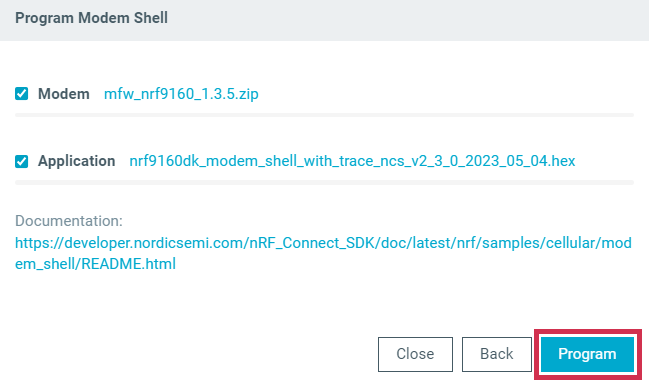

# Programming the nRF9160 DK firmware

You can program the nRF9160 DK application and network core firmware over USB by using MCUboot using the Cellular Monitor app.

!!! note "Note"
     This option is only available for the nRF9160 DK and Nordic Thingy:91.

To program the firmware on the nRF9160 DK, complete the following steps:

1. Open the Cellular Monitor app.
1. Punch out the nano-SIM from the SIM card and plug it into the SIM card holder on the nRF9160 DK.
1. Make sure the **PROG/DEBUG SW10** switch on the nRF9160 DK is set to **nRF91**.
   On DK v0.9.0 and earlier, this is the **SW5** switch.
1. Connect the nRF9160 DK to the computer with a micro-USB cable, and then turn the DK on.
1. Click **SELECT DEVICE** and select the DK from the drop-down list.

    

   The drop-down text changes to the type of the selected device, with its SEGGER ID below the name.

1. Click **Program device** in the **ADVANCED OPTIONS** section.

    

   The **Program sample app** window appears, displaying applications you can program to the DK.

1. Click **Select** in the **Modem Shell** section.

    

   The **Program Modem Shell** window appears.

1. Click **Program** to program the DK.
   Do not unplug or turn off the device during this process.

    

   When the process is complete, you see a success message.
   Click **Close** to close the **Program Modem Shell** window.
