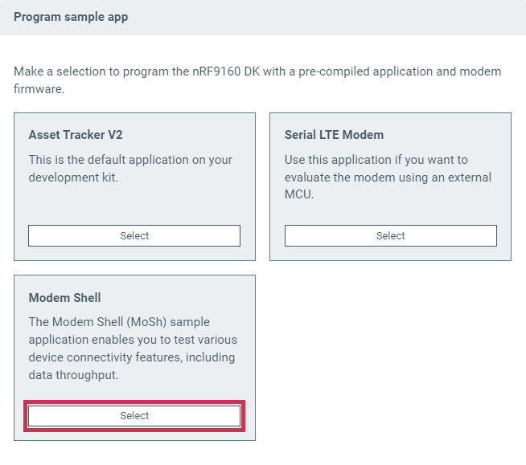

# Programming Nordic Thingy:91 firmware

You can program the Nordic Thingy:91™ application and network core firmware over USB by using MCUboot using the {{app_name}}.

!!! note "Note"
     This procedure for programming with one of the built-in samples or required modem firmware is only available for Nordic Thingy:91.
     A similar procedure is available for the [nRF9160 DK](programming_91dk.md).
     For all other compatible devices (including custom boards), see [Software requirements](./requirements.md#software-requirements).

To program the firmware on Nordic Thingy:91 using the {{app_name}}, complete the following steps:

1. Open the {{app_name}}.
1. Click **Select Device** and select Nordic Thingy:91 from the drop-down list.

    

    The drop-down text changes to the type of the selected device, with its SEGGER ID below the name.

1. Click **Program device** in the [**Advanced options**](./overview.md#advanced-options) section.

    

    The **Program sample app** window appears, displaying applications you can program to the Thingy:91.

1. Click **Select** in the **Modem Shell** section.

    

    The **Program Modem Firmware (Optional)** window appears.

1. Click **Select** in the section for the latest modem firmware.

    The **Program Mode Firmware (Optional)** window expands to display additional information.

    

1. Switch off the Thingy:91.
1. Press **SW3** while switching **SW1** to the **ON** position to enable the MCUboot mode.
1. Click **Program** to program the modem firmware to the Thingy:91. 
   Do not unplug or turn off the device during this process. 
   When the process is complete, you see a success message. 
   If you see an error message, switch off the Thingy:91, enable MCUboot mode again, and click **Program**.

1. Click **Continue** to move to the next step. 
   The **Program Mode Firmware (Optional)** window changes to the **Program Modem Shell** window.

1. Switch off the Thingy:91.
1. Press **SW3** while switching **SW1** to the **ON** position to enable the MCUboot mode.
1. Click **Program** to program the application to the Thingy:91. 
   Do not unplug or turn off the device during this process. 
   When the process is complete, you see a success message.
1. Click **Close** to close the **Program Modem Shell** window.

If you see an error message, switch off the Thingy:91, enable the MCUboot mode again, and click **Program**.
